# Dragon Ball Z: Budokai Tenkaichi 3 (Wii) Reverse Engineering Guide

## Table of Contents
- [Prerequisites](#prerequisites)
- [Required Software](#required-software)
- [Background Information](#background-information)
- [Getting Started](#getting-started)
- [Setting Up Debug Environment](#setting-up-debug-environment)
- [Debugging and Reverse Engineering](#debugging-and-reverse-engineering)

## Prerequisites

Basic C programming knowledge is required. While you don't need to be an expert, you should understand the following concepts:

- Variables and data types
- Logical operators
- Conditional statements
- Loops
- Functions
- Pointers

## Required Software

(Feel free to download them as you go along, as some steps might not be needed)

1. [Ghidra](https://ghidra-sre.org) 11.2.1 for code decompilation
2. Dolphin 5.0 for game emulation, extracting game file and improved debug mode
3. [Dolphin Memory Engine](https://github.com/aldelaro5/dolphin-memory-engine)

## Background Information

### DOL Files
A DOL file (.dol) is the main executable format used by Nintendo GameCube and Wii consoles. Named after the GameCube's development codename "Dolphin," these files function similarly to .exe files on Windows computers. DOL files contain the compiled game code and can be up to 7MB in size for Wii games. They serve as the primary program that runs the game, handling essential functions like loading game assets and managing memory.

> **Note**: Always backup DOL files before modification as they are crucial to the game's operation.

### Assembly Language
Assembly language is a low-level programming language that corresponds directly to machine code instructions. It typically results from compiling high-level code into platform-specific format.

### BT3 Wii Assembly Language
BT3 Wii uses PowerPC Gekko assembly language, which was standard for GameCube systems with IBM Gekko processors. The Wii's IBM Broadway processor maintains backward compatibility with this instruction set.

## Getting Started

### Extract the DOL File from the ISO

1. Select the game in the Dolphin browser menu, right-click and select "Properties"
2. Go to the "Filesystem" tab (on the far right)

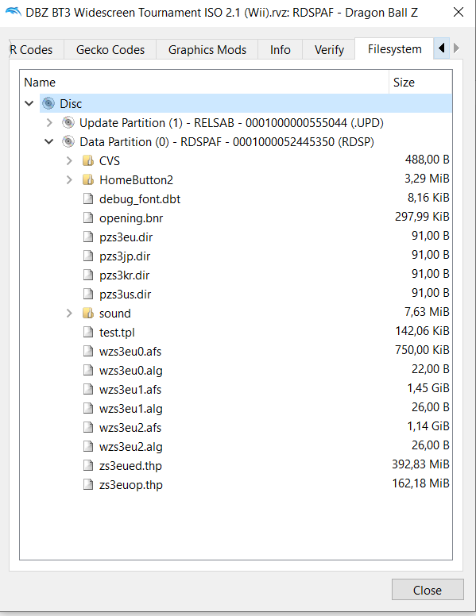

3. Right-click the Disc on top and select "Extract entire Disc..." and extract the content to a folder (Don't extract it in the Git folder, this is your testing environment)
4. Navigate to `DATA/sys/` in the extracted folder to find `main.dol` - this is the game's code we'll be working with

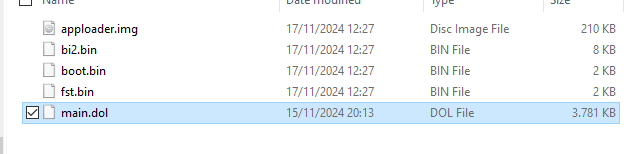

### Decompiling the DOL File

1. Set up Ghidra:
   - Create a new project (or open existing project "BT3 rollback.gpr")
   - Import the DOL file
   - Select PowerPC, 32, big Endian and default compiler for the language variant

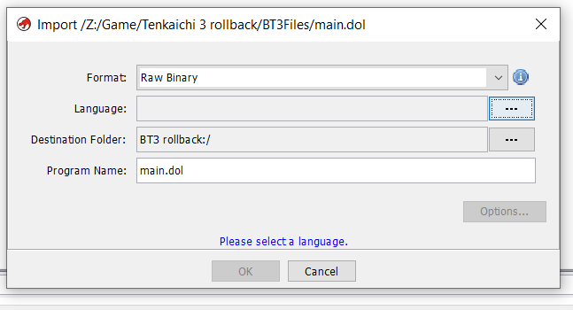
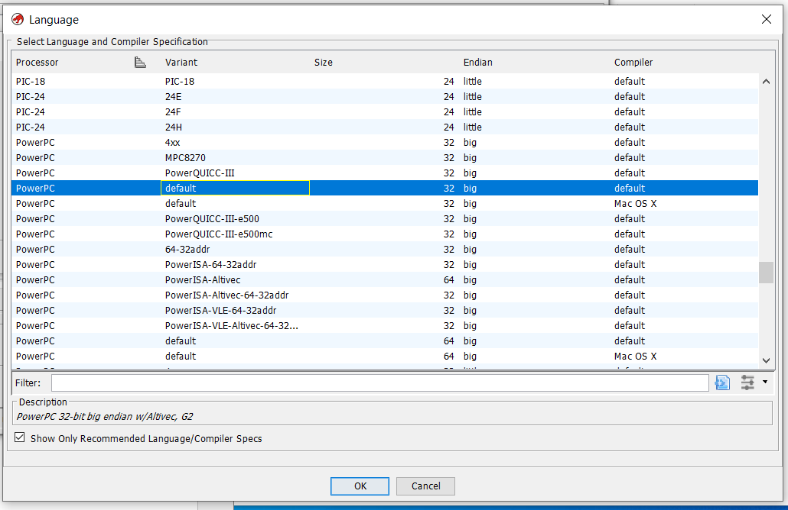

2. Open main.dol and run the initial analysis when prompted

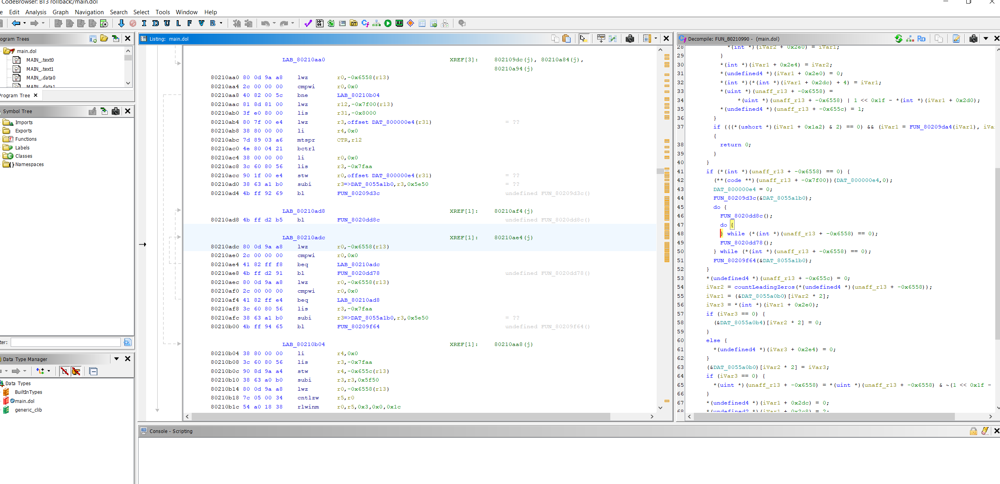

## Setting Up Debug Environment

### Dolphin Debug Mode

1. In Dolphin's toolbar, select "Options > Configuration"
2. Under the "Path" tab:
   - Click "Add" and select your extracted game folder
   - Ensure "Search Subfolders" is checked
3. Dolphin should now recognize the extracted game that we will use to debug with, in this case the 0,00 B* one.

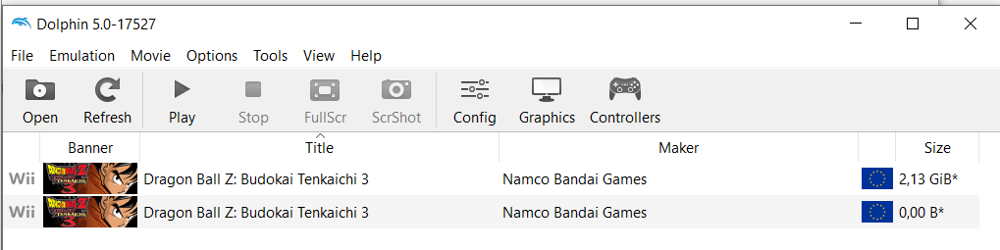

4.	Once again on the tool bar, select “Options>Configuration”.
5.	Under the “Interface” tab, check “Show Debugging UI”.
6.	Then in “View” show all the following.

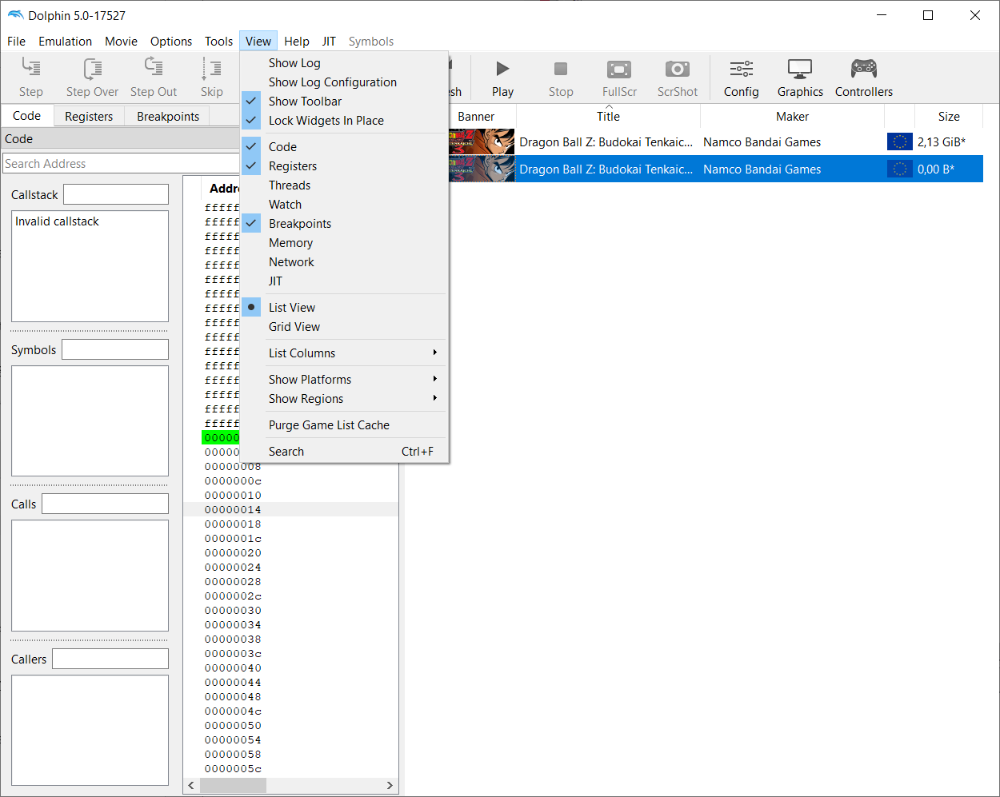

7.	Now we have debug mode!

> **Tip**: Enable "Boot to Pause" under "Options" to catch code that executes at startup

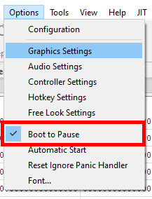

### Dolphin Memory Engine Setup

1. Clone and build from [this GitHub repository](https://github.com/aldelaro5/dolphin-memory-engine)
- follow “How to Build”

> **Windows Build Note**: If you encounter the CRT_SECURE warning, add `#define _CRT_SECURE_NO_WARNINGS` at the beginning of the offending code.

   - Build in Release mode for better performance
   - Find the executable at `Source\bin\Release\dolphin-memory-engine.exe`

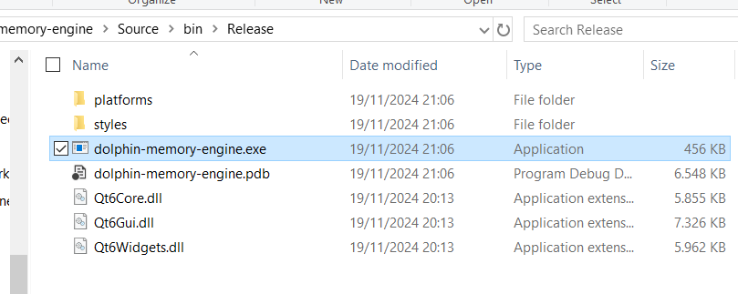

   - If you use Linux or OSX you probably know what you’re doing and how to fix them but just in case, feel free to mention any problem and add them here

2. Run alongside Dolphin debug mode for complete debugging environment

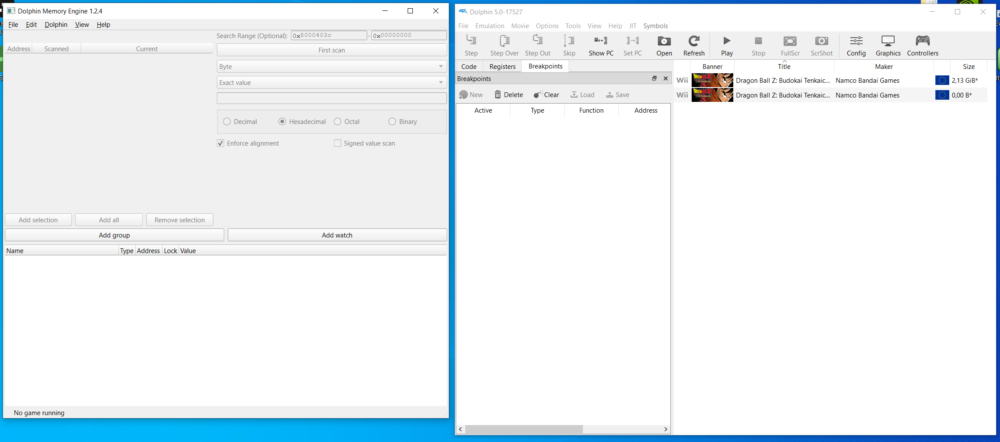

## Debugging and Reverse Engineering

### Overview

The reverse engineering process combines three main tools:
- Dolphin's debug menu for code execution control
- Dolphin Memory Engine for memory monitoring
- Ghidra for code analysis and documentation

### Core Workflow

1. **Code Investigation**
   - Set breakpoints at key locations using Dolphin's debug menu
   - Monitor code execution through stepping commands
   - Identify critical code paths during specific game events

2. **Memory Analysis**
   - Track memory changes using Dolphin Memory Engine
   - Label important memory addresses
   - Save memory watch groups (.dmw files)

3. **Documentation**
   - Document findings in Ghidra through function renaming and commenting
   - Map out key systems:
     - Dragon net battle menu
     - Duel mode logic
     - Fighting game logic
     - Game rendering
     - Sound call system
     - Input handling

!!! Will be continuing the document, currently making example by watching memory address in main menu to figure out: menu functions, target menu pointer address and hopefully some input handler function

### Example Workflow (In Progress)

1. **Planning Phase**
   - Plan what you want to do. Going in without having an idea about what you’re trying to do will not yield any result.
   - For this example I plan to figure out the code of the main menu, specifically some form of target menu address pointer. Obviously the game has to store which menu I want to enter, I can most likely assume that moving the selection up and down in the main menu will change some kind of value to indicate that. I’ll be looking for that.
   - Once I figure that out it should be much easier to figure out where everything is, since we will know at the very least which part of the instruction code corresponds to the menu of that mode.

2. **Save State Preparation**
   Create a save state at the main menu for quick testing

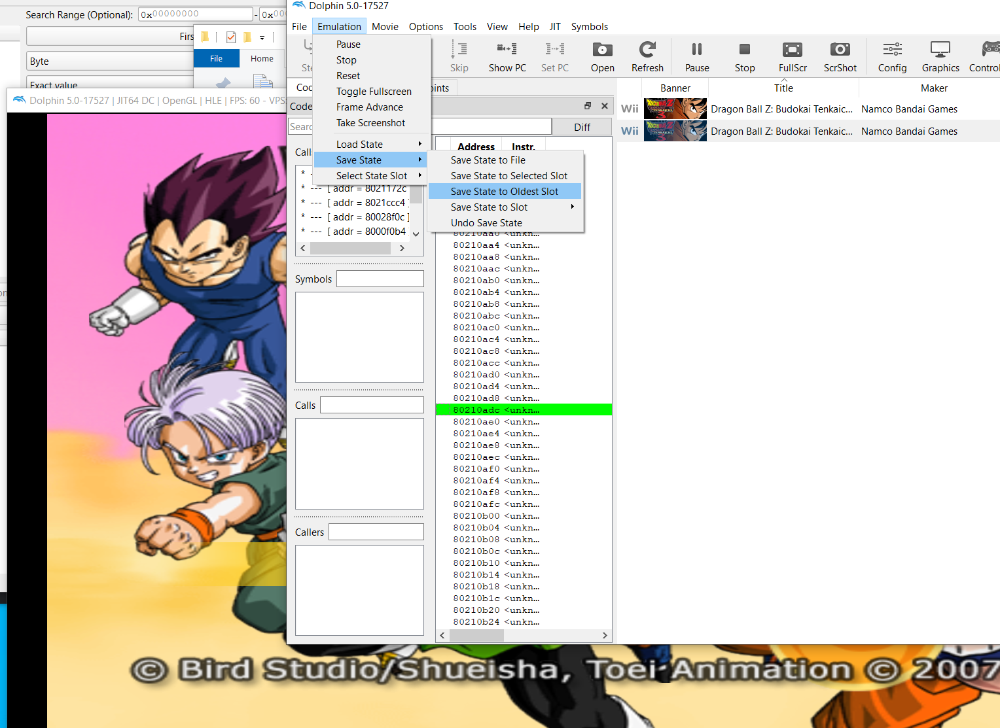

