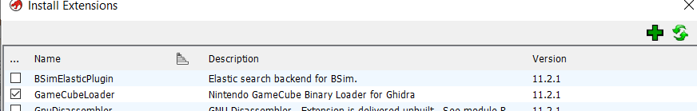

# Dragon Ball Z: Budokai Tenkaichi 3 (Wii) Reverse Engineering Guide

## Table of Contents
- [Prerequisites](#prerequisites)
- [Required Software](#required-software)
- [Background Information](#background-information)
- [Getting Started](#getting-started)
- [Setting Up Debug Environment](#setting-up-debug-environment)
- [Debugging and Reverse Engineering](#debugging-and-reverse-engineering)


## Prerequisites

Basic C programming knowledge is required. While you don't need to be an expert, you should understand the following concepts:

- Variables and data types
- Logical operators
- Conditional statements
- Loops
- Functions
- Pointers

Basic assembly knowledge is required when debugging the game's instructions.

## Required Software

(Feel free to download them as you go along, as some steps might not be needed)

1. [Ghidra](https://ghidra-sre.org) 11.2.1 for code decompilation
2. Dolphin 5.0 for game emulation, extracting game file and improved debug mode
3. [Dolphin Memory Engine](https://github.com/aldelaro5/dolphin-memory-engine)

## Background Information

### DOL Files
A DOL file (.dol) is the main executable format used by Nintendo GameCube and Wii consoles. Named after the GameCube's development codename "Dolphin," these files function similarly to .exe files on Windows computers. DOL files contain the compiled game code and can be up to 7MB in size for Wii games. They serve as the primary program that runs the game, handling essential functions like loading game assets and managing memory.

> **Note**: Always backup DOL files before modification as they are crucial to the game's operation.

### Assembly Language
Assembly language is a low-level programming language that corresponds directly to machine code instructions. It typically results from compiling high-level code into platform-specific format.

### BT3 Wii Assembly Language
BT3 Wii uses PowerPC Gekko assembly language, which was standard for GameCube systems with IBM Gekko processors. The Wii's IBM Broadway processor maintains backward compatibility with this instruction set.

## Getting Started

### Extract the DOL File from the ISO

1. Select the game in the Dolphin browser menu, right-click and select "Properties"
2. Go to the "Filesystem" tab (on the far right)


3. Right-click the Disc on top and select "Extract entire Disc..." and extract the content to a folder (Don't extract it in the Git folder, this is your testing environment)
4. Navigate to `DATA/sys/` in the extracted folder to find `main.dol` - this is the game's code we'll be working with


### Setting up Ghidra

1. Set up Ghidra Gamecube Binary Loader

   - Ghidra doesn't include Wii language decompilation by default, you need to get it [here](https://github.com/Cuyler36/Ghidra-GameCube-Loader/releases). Do not follow any of the instructions in the repo, (it's a lie and it will cost you precious time) instead, download the .zip file and move it under `Extension/Ghidra/` with all the other .zip extensions that came in by default.

   - Once you do that, you can install that extension and you will have this option when importing the .dol file.

      

      

2. Import and export Ghidra files

   - Due to how Ghidra handles user-specific paths and permissions within the project files, we need to import and export the project as an archive file (.gar)
   - To import in Ghidra via: 
      - Select File > Restore Project
      - Select "BT3 rollback.gar" as the Archive File
      - Select a directory outside of the git folder for the Restore Directory (this will be your Ghidra workspace)

      

   - Select main.dol. You should now see this:

      

   - To export the project after you made any sort of editing:
      - Select File > Archive Current Project 
      - Make sure to name it "BT3 rollback.gar" and in the same directory so it rewrites to update.

   > **Note:** Ghidra is stupid sometimes, it will show you a value that seems different from the code you see in dolphin that's being run. But most of the time it is because it shows it incorrectly:
   >  -  Instead of `0x8056`, it shows `-0x7faa` in the same address and same instruction. This is because:
   >     - -0x7faa in binary: 1000 0000 0101 0110
   >     - 0x8056 in binary:  1000 0000 0101 0110
   >  - Some values are actually equivalent in binary so be careful

## Setting Up Debug Environment

### Dolphin Debug Mode

1. In Dolphin's toolbar, select "Options > Configuration"
2. Under the "Path" tab:
   - Click "Add" and select your extracted game folder
   - Ensure "Search Subfolders" is checked
3. Dolphin should now recognize the extracted game that we will use to debug with, in this case the 0,00 B* one.


4.	Once again on the tool bar, select “Options>Configuration”.
5.	Under the “Interface” tab, check “Show Debugging UI”.
6.	Then in “View” show all the following.


7.	Now we have debug mode!

> **Tip**: Enable "Boot to Pause" under "Options" to catch code that executes at startup


### Dolphin Memory Engine Setup

1. Clone and build from [this GitHub repository](https://github.com/aldelaro5/dolphin-memory-engine)
   - follow “How to Build”
      > **Windows Build Note**: If you encounter the CRT_SECURE warning, add `#define _CRT_SECURE_NO_WARNINGS` at the beginning of the offending code.

      - Build in Release mode for better performance
      - Find the executable at `Source\bin\Release\dolphin-memory-engine.exe`

      

      - If you use Linux or OSX you probably know what you’re doing and how to fix them but just in case, feel free to mention any problem and add them here

2. Run alongside Dolphin debug mode for complete debugging environment


> - **Note:** sometimes you need to unhook and re-hook the memory engine if it is not reading the memory well

## Debugging and Reverse Engineering

### Overview

The reverse engineering process combines three main tools:
- Dolphin's debug menu for code execution control
- Dolphin Memory Engine for memory monitoring
- Ghidra for code analysis and documentation

### Core Workflow

1. **Code Investigation**
   - Set breakpoints at key locations using Dolphin's debug menu
   - Monitor code execution through stepping commands
   - Identify critical code paths during specific game events

2. **Memory Analysis**
   - Track memory changes using Dolphin Memory Engine
   - Label important memory addresses
   - Save memory watch groups (.dmw files)

3. **Documentation**
   - Document findings in Ghidra through function renaming and commenting
   - Map out key systems:
     - Dragon net battle menu
     - Duel mode logic
     - Fighting game logic
     - Game rendering
     - Sound call system
     - Input handling

!!! Will be continuing the document, currently making example by watching memory address in main menu to figure out: menu functions, target menu pointer address and hopefully some input handler function

### Example Workflow
> **Note**: You can do these things out of order, it depends on what you do. This example actually shows me failing a few times and switching methods as I went along (it took us until step 9 to find anything useful). I recommend to first read through this section before following anything in this part

1. **Planning Phase**
   - Plan what you want to do. Going in without having an idea about what you’re trying to do will not yield any result.
   - For this example I plan to figure out the code of the main menu, specifically some form of target menu address pointer. Obviously the game has to store which menu I want to enter, I can most likely assume that moving the selection up and down in the main menu will change some kind of value to indicate that. I’ll be looking for that.
   - Once I figure that out it should be much easier to figure out where everything is, since we will know at the very least which part of the instruction code corresponds to the menu of that mode.
   - If needed, use Ghidra's help to slightly brute force some function

2. **Save State Preparation**
   Create a save state at the main menu for quick testing


3. **Start and Try**
   - I begin by just entering the main menu and hit pause to see what codes are running

   

   >**Tip:** Rejoice, we live in an era where we can ask specific instruction pattern and get answer from LLMs (ChatGPT and the likes) to easily analyze parts of a list of instruction. Feel free to do so!
 
   - When I start pressing Step, the instruction would execute and continue. The current **Processing Cycle (PC)** is highlighted in green, as I do so I realized that the instructions are looping within the three instruction marked in red.

   

   ```
   80210adc lwz r0, -0x6558 (r13)   # Loads a word from memory address (r13 - 0x6558) into r0
   80210ae0 cmpwi r0, 0             # Compares r0 with 0
   8021ae4 beq+ ->0x80210ADC        # Branch if equal (r0 == 0) back to the first instruction
   ```

   -  This is a loop:
   1. First, it loads some value from memory (offset -0x6558 from whatever r13 points to) into r0
   2. Then it compares that value with 0
   3. If the value is 0, it branches back to the start (note the branch target 0x80210ADC matches the address of the first instruction)

   - Next to find out what's in memory address `r13 - 0x6558`
      - Luckily we can just copy the address number by right-clicking the parameter and select "Copy target address", we get 0x8062ADC8
      - Just to be safe let's actually get the value to make sure I didn't mess up
         - Going to Register, under r13 I find `80631320`
         - `0x80631320 - 0x6558 = 0x8062ADC8`

   - We then watch the memory in the address through Dolphin memory engine
      - Select "Add watch" and input the address value
      - Here's hoping this is some form of input flag, I labeled the memory as `????input buffer` 
      - > This is a bit of guess work: Since I saw that the instruction loop is 3 instructions, it's safe to assume no complex logic is being done here. In fact there isn't any logic here since it's only making a comparison between 0 and a value.

         

   - To test it out, I resumed the game's program by pressing "Play" on the emulator and started to press up and down to see what changed.
   - It didn't change and just stayed 0, so it's not input related. If it was some kind of input buffer the value would have changed

4. **Analyze the problem**
   - So the naive hope didn't pan out, time to look for other hypothesis.
   - There are many things that I can do from here: 
      - Try another guess (with the value staying at 0 didn't give me many option though)
      - Resume and pausing and game to see if there are any other code that happen
      - Look for memory changes
      - etc.
   - I've decided to just play pause the game repeatedly to see if there are any changes.
   - > Considering the game did in fact run and I can move in the menu, it is impossible that the loop goes on forever and the value is actually 0. It's just that I couldn't see the changes.
   - Something new happened:
   
   - New hypothesis: The memory in `0x8062ADC8` is changing but not on the right part.
   - Instead of byte i should have put a bigger range like 4 byte (word).
   - Right-click the watched value, I can select "Browse memory at this address"
      - This window should show up
      
   - Immediately I noticed something: Since this window  updates the scanned value faster (changes highlighted in red) I can actually see that `0x8062ADC8`'s value actually did change, but only as a 4 byte data.
      - from `0x0` to `0x80`, which is actually a very important value, `0x80` is 128 in decimal.
   - It's a value switching between 0 and 128 (0x80) that's being repeatedly checked in a loop, this is most likely a semaphore or flag being used for synchronization!
   - Actually, with the help of ChatGPT and cross referencing with Wii documentation: a memory address in the `0x806xxxxx` range on the Wii, that's typically in the operating system/IOS memory range.
   - So the 3 instruction loop is most likely just a hardware status sync check of some form, meaning going back to the initial 3 instruction loop can be assumed as some form of hardware sync check and what happens afterwords is the actual game instructions.
   - I can label this memory as `??IOS_SyncFlag_80_0` for the moment and try to determine the rest of the instructions after this 3 instruction sync check.

5. **Dolphin Memory Watch File**
   - Dolphin memory engine has a way to open and save memory address watch list.
   - For the sake of not having to keep relabeling memory and easily check through different section of the game, we can save the current watch list as a file and later open them under `File > Save` or `File > Open`.
   - Save and open this file under **[this directory](/DMW/)** and follow the **[labeling-rule](/Docs/label-rule.md)** for easy understanding.

6. **The Lazy way (Not working for me)**
   - Dolphin memory engine has a scan function that can check if a value has changed in memory (those who use cheat engine know what I mean)
   - You can set the first scan to any initial value and make changes or not make changes to the current game state and continue to do followup scans to retain or remove memory that's changed or unchanged.
   - I  tried to look for menu address pointer with this method by changing selection in main menu, didn't work. I don't know why

7. **Following the code**
   - At certain points I will have to simply follow the instruction path and not just using "Step" or repeatedly "Pause" and "Play" since eventually it will be a bit too luck based.
   - For this scenario I will attempt to follow the original 3 instruction loop and see what happens from there and record as many memory address that gets read or written until I either:
      - circle back to a loop (a safe assumption to make since in this situation in some way the Processing Cycle always returns back to the `8021ADC`, processing address) or
      - I recorded enough memory address that I can try to see the changes in the memory engine again, or
      - if somewhere down the line I got lost in the huge pile of code.
   - At this point I'm going to be looking at Ghidra's decompilation window from time to time to make things easier for me, I can simply copy the address of the current Processing Cycle address find the same code address in Ghidra.
      - In Ghidra by pressing the **G** key we can bring up a search that can take us directly to an address instead of scrolling up and down.
      
   - With any luck, I could simply look at the decompiled code and hopefully intuit what the code does.
   > **Warning:** Do not change any values in Ghidra. If you see some incorrectly interpreted values as shown before, do not change it. Ignore it for now and only use Ghidra as a tool to see if there are anything you can recognize in the code in terms of logic.
   - So I'm currently in some kind of hardware syncing process, so looking at the decompiled code here probably isn't that helpful, let's instead follow the code in Dolphin debug mode and record any memory address we find.
   - Here we can see outside of the loop `beq+  ->0x80210ADC` we have an instruction `bl	->0x8020DD78` that takes us quite far into the game's code, in fact the immediate after portion of this code also could leads into somewhere quite close to that location `bl	->0x8020DD8C` (after jumping  back from `beq+	 ->0x80210AD8`)

      

      - also there doesn't seem to be anything else that looks like it's worth watching so nothing to add to the memory watch list.

   - Let's check out what's in `0x8020DD78`, simply right-click and select `follow branch` to begin the adventure.
   
      > **Important:** Keep note on where you were before you `follow branch`, if the branch ends in a return instruction (`blr`) then you'll have to backtrack.
 
      

   - And it's another hardware system check protocol section
      - `blr` here are basically return calls.
      - there are also a bunch of `msr` (Machine State Register) related instructions 
      > frequently ask ChatGPT and most of the time the answers will give a few easy hints on what's happening
      ```
      8020dd78 mfmsr r3          # Read current MSR value into r3
      8020dd7c rlwinm r4,r3,0,17,15  # Rotate left and mask: clear bit 16 (0x8000) in r3, store in r4
      8020dd80 mtmsr r4          # Write modified value back to MSR
      8020dd84 rlwinm r3,r3,17,31,31 # Extract original bit 16 state into r3
      8020dd88 blr               # Branch to Link Register (return)

      8020dd8c mfmsr r3          # Read MSR into r3 again
      8020dd90 ori r4,r3,0x8000  # Set bit 16 (OR with 0x8000)
      8020dd94 mtmsr r4          # Write modified value back to MSR
      8020dd98 rlwinm r3,r3,17,31,31 # Extract original bit 16 state
      8020dd9c blr               # Return
      ```
   - Since these are hardware system related stuff and they just return, time to backtrack.
      
   - Looking at it now it's becoming clear that this is some instruction loop that would check for hardware flags that would then trigger some operations with `msr`.
   - Time to continue. Since `beq+  ->0x80210AD8` ultimately results into the second function `8020dd8c`, we will start from `80210af8  lis	r3, 0x8056`
      ```
         80210af8 lis r3, 0x8056      # Load Immediate Shifted: loads 0x8056 into upper 16 bits of r3
         80210afc subi r3, r3, 24144   # Subtract Immediate: subtracts 24144 from r3
         80210b00 bl ->0x80209F64      # Branch and Link to that address
      ```
      

   - More instructions
      ```
         80209f64 li     r5, 0         # Load Immediate: sets r5 to 0
         80209f68 lis    r4, 0x8000    # Load Immediate Shifted: loads 0x8000 into upper 16 bits of r4
         80209f6c ath    r5, 0x01A0 (r3)  # Add to High: adds 0x01A0 to r5, indexed by r3
         80209f70 ath    r5, 0x01A2 (r3)  # Add to High: adds 0x01A2 to r5, indexed by r3
         80209f74 lwz    r0, 0x00D8 (r4)  # Load Word and Zero: loads from r4+0xD8 into r0
         80209f78 cmplw  r3, r0        # Compare Logical: compares r3 with r0
         80209f7c bnelr-              # Branch Not Equal and Link Register: returns if not equal
         80209f80 stw    r5, 0x00D8 (r4)  # Store Word: stores r5 to r4+0xD8
         80209f84 blr                  # Branch Link Register: return
      ```
   - This looks like a validation or comparison function that:
      1. Sets up some values in r4 and r5 through a series of loads and adds
      2. Loads a value from memory (0xD8) into r0
      3. Compares that with the input parameter that was in r3
      4. Returns immediately if they're not equal (bnelr)
      5. If they are equal, stores some values to memory before returning
      - The function appears to be doing some kind of check or validation, possibly related to memory addresses or system state, since it's working with the high memory address range (0x8000xxxx).
   - There are also a few memory address that are being compared here, I'll put that memory address in the watch list. It's probably nothing game logic related again but will still add for completion sake, might come in handy who knows.
      - These memory addresses are relative to the register, so some of them can't be assumed to be static.
      - But in this case we can know for sure the r3 and r4 values are fixed since the previous instructions all set them to a fixed value through `lis` and the sorts
      - On `80209f74 lwz   r0, 0x00D8 (r4)`, the location will always be `0x800000D8` (adding to the memory watch list)
      - On `80209f78 cmplw r3, r0`, r3 will always be `0x8055A1B0` (adding to memory watch list)
      - First ath: memory at `0x8055A1B0 + 0x01A0 = 0x8055A350` 
      - Second ath: memory at `0x8055A1B0 + 0x01A2 = 0x8055A352`
   - Since things have still been revolving around hardware system checking and validations, I'll skip over these parts until something exciting shows up.

> - **Tip**: For potentially dynamic memory, if you're lazy you could simply add a breakpoint to that instruction address when it makes a comparison.

8. **Brute force function break point**

   - I got lost 3 branches in.
      - Fortunately I found a few memory address that the instructions were using to compare for something.
      - Unfortunately they are 0 or 128 values, meaning they are in fact simply some sort of hardware sync flag. Not useful

         
   - Let's try another approach, my favorite - Brute force
      - Anyone with half a brain cell in programming understands that brute forcing anything is generally a bad idea, thats why we need to have some way of narrowing our range of brute forcing.
      - Thankfully we do have that narrower range - the Ghidra project (it might have missed some part, but it is a good starting point).
   - The Ghidra project opened from **[here](/Ghidra/)** actually shows these automatically recognized and decompiled functions
      
      

      - The list of functions in the folder on the left, the corresponding assembly instructions in the middle and the corresponding  decompiled C code on the right.
   - Here we can actually see a bit better on what's potentially going on (still really hard but better than just reading assembly instructions).
      - At this point we could select every function on the left and look at the code on the right one by one and hope to see some kind of hint of game logic.
      - Or I could do it the simple way of just using breakpoints.
   - Since Ghidra actually shows where each of these function's instruction address lie, we can use those address to create breakpoint in Dolphin's debug mode.
      - Create a new breakpoint like so (select "New")

         

   - After the break point is added, I can resume the game and do some action I want to test.
      - If the game goes reaches the breakpoint the game will pause automatically, telling me that the section of the code interacts with whatever action I just did.
      - If the game doesn't pause it means the code has nothing to do with what I am doing and we can go to the next function and try again (Make sure to clear the breakpoints and testing this out one by one).
   - Since I'm still trying to figure out the main menu related code I'll try to find out what code actually triggers the breakpoint when press the d-pad up and down.
   - After a few function breakpoints I got a hit:

      
      
      - The breakpoint I placed on the instruction address `0x80008d10` triggered and paused the emulation when I pressed down on the d-pad
      - After I resume the game it resumed.

         

      - This could be an input handler, but just in case I'll test and see what else triggers the breakpoint.
      - The breakpoint didn't trigger when I press left or right or pressed X in attempt to enter a menu - So not an input handler, or at least not a full input handler.
      - The breakpoint triggered immediately after the submenu loads in (specifically exactly after the transition is finished), the up and down movement in that submenu and when I try to exit the submenu, when the main menu is loaded.
      - This seems like a menu transition handler function.
   - Time to record and watch any memory address this function read and write to and what it compares to, if we can figure out what these memory mean we can slowly understand more clearly what this function does.
      > - **Note**: Make sure to check the memory address is not dynamic by either checking the address by stepping and confirming the target address twice per attempt or if you can see that the registers that are used for the position of memory address is indeed static for that portion from the code (e.g `li`).
   - After analysis, it's another dud, this is most likely a float value clamping function (keeping a value within certain bounds as to not crash the system)
      - the memory added to watch are show values like `-32`, `-128` and the likes
      - looking at the decompiled C code one can also surmise that this doesn't actually contain any logic but instead some basic float operation loops without any conditions
      - Since it seems pretty sure what this is with the float operation and whatnot I will label the function "?menu_transition_val_clamp". (right-click the function and select `"Edit Function Signature"`)

         

      > Note: Again, don't forget to save the ghidra project the way shown on top.

   - Continue to the next function

9. **Finding something**
   - We found something!!!
      - A friend was doing a similar thing on the character select menu and figured out `800b3834` is called every tick in the menu.
      - After a bit of tracking, he figured out the current character select ID might be `912c6353`.
   - Immediately I began to look at the memory address and find out more, and boy did we find a lot.
      - I entered 1P vs 2P team battle character select menu (Since this is the best menu to use entering combat mode with the character data to enter rollback netplay).
      - Observed the memory in that region while fiddling around with the character selection with both P1 and P2 and ended up with these discovery:
      
         
         
         
         
         
   - As shown in the image, these different 4 byte and 1 byte data represent a lot of different things and are useful for the begin fight function I plan to directly call from Dolphin after selecting characters in Dolphin (see [readme.md](/readme.md)).
   - Now that we know these data are being stored here, these data must read and used in a function somewhere to begin the combat game mode. We're going to find it.
      - On Dolphin debug mode, we can add a memory breakpoint that triggers when the memory of the character ID gets read or written.
      - We're using write to log only here because these data are apparently being read multiple times per second. If we set it to pause it will just pause every frame and we won't be able to do anything
         > Log under **View** in toolbar

         [breakpoint setting image here]

         > In Log Configuration make sure to toggle all log type
      - After picking the stage and music and pressing ready, the game will start loading. Here is where we will look at the log, bingo!
         
         > - Here we can see among the repetitive call of `800b33e4` at the end we have one instruction address that is unique `800b7488` that is also immediately overwritten afterwards (I checked and the data is almost certainly gibberish in memory:`85f0f783`) 
         - Just to confirm I will do the same thing with the other character IDs, color ID, map ID, music ID, etc.
         - `800b7488` executed 4 times, it read the character ID of all the characters that are in team P1 and team P2. This is a character loader.
         - Next is to follow the trail and find more things useful (target: combat loader function)

10. **Continue**
   - That's it! That's the idea of reverse engineering, we just keep finding stuff we're interested in that we could understand more and use through either force execute through Dolphin or we can change the game through code injection (will make a doc when the time comes and if we need it)
   - For now we will continue to find more memory address, game state value, combat related logic functions that we can use for the rollback logic I wrote in the modded Dolphin emulator that's still in progress.
   - Look at the [readme](/readme.md) to see what is needed and just find stuff.